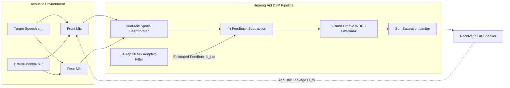

# Audiological DSP Studio — Binaural Hearing Instrument Simulator

An interactive, in-browser digital signal processing (DSP) console modeling the embedded audio pipeline of modern hearing instruments (such as Oticon Intent, Widex Moment, and ReSound Nexia).

🔗 **Live In-Browser Simulator:** [https://elomarjc.github.io/hearing-aid-dsp-studio/](https://elomarjc.github.io/hearing-aid-dsp-studio/)

---

## 1. System Architecture & Engineering Overview

Hearing instruments face an acute physical trade-off: high acoustic insertion gain in open-vent fittings causes acoustic energy from the ear canal receiver to leak back into the microphone ports, creating unstable closed-loop oscillation (whistling/howling). Simultaneously, extracting speech in noisy environments requires sub-centimeter spatial beamforming and dynamic range compression fitted to the individual's audiological loss.

This studio implements the complete end-to-end hearing aid signal chain in real time:



---

## 2. Mathematical Foundations

### 2.1 Dual-Microphone Differential Beamforming

The dual-microphone array uses an endfire configuration with microphone spacing $d = 12\text{ mm}$. The acoustic travel time across the array is:

$$
\tau_0 = \frac{d}{c} \approx 34.98\ \mu\text{s}
$$

where $c = 343\text{ m/s}$ is the speed of sound.

The delay-and-sum differential output is formed by delaying the rear microphone signal electronically by $\tau_i$ and subtracting:

$$
y[n] = x_{\text{front}}[n] - \beta \cdot x_{\text{rear}}[n - \tau_i]
$$

The spatial directivity transfer function for an incident angle $\theta$ (where $\theta = 0^\circ$ is on-axis front) is:

$$
H(\omega, \theta) = 1 - \beta \cdot \exp\left(-j \omega \left(\tau_0 \cos\theta + \tau_i\right)\right)
$$

* **Cardioid ($\tau_i = \tau_0, \beta = 1.0$):** Produces a deep theoretical null at $\theta = 180^\circ$ (rear).
* **Supercardioid ($\tau_i = 3\tau_0, \beta = 0.577$):** Maximizes the Directivity Index ($DI \approx 5.7\text{ dB}$), placing nulls at $\pm 126^\circ$.
* **Hypercardioid ($\tau_i = \tau_0/3, \beta = 0.707$):** Places symmetrical nulls at $\pm 110^\circ$.
* **Adaptive MVDR:** Adaptively updates $\beta$ to minimize output energy while constraining unit gain on-axis.

The Directivity Index (DI) is computed over the sphere:

$$
DI(\omega) = 10 \log_{10}\left( \frac{2}{\int_{0}^{\pi} |H(\omega, \theta)|^2 \sin\theta\, d\theta} \right)
$$

---

### 2.2 Normalized LMS Adaptive Feedback Cancellation (AFC)

The physical ear canal leakage path is modeled as an acoustic impulse response vector $\mathbf{h}_{\text{fb}} \in \mathbb{R}^N$ ($N = 64$ taps). The estimated feedback signal $\hat{d}[n]$ is synthesized from the receiver output history $\mathbf{x}[n]$:

$$
\hat{d}[n] = \mathbf{w}^T[n] \mathbf{x}[n]
$$

The error signal $e[n]$ represents the cleaned speech and background sound:

$$
e[n] = d[n] - \hat{d}[n]
$$

Filter weights are updated using Normalized Least Mean Squares with parameter leakage $\gamma = 0.9998$ to prevent coefficient drift in silence:

$$
\mathbf{w}[n+1] = \gamma \mathbf{w}[n] + \frac{\mu}{\epsilon + \|\mathbf{x}[n]\|^2} e[n] \mathbf{x}[n]
$$

Echo Return Loss Enhancement (ERLE) quantifies howling suppression:

$$
ERLE = 10 \log_{10}\left( \frac{E\{d^2[n]\}}{E\{e^2[n]\}} \right)
$$

---

### 2.3 6-Band Wide Dynamic Range Compression (WDRC)

The input signal is decomposed into 6 standard octave bands centered at $250\text{ Hz}$, $500\text{ Hz}$, $1000\text{ Hz}$, $2000\text{ Hz}$, $4000\text{ Hz}$, and $8000\text{ Hz}$ using 2nd-order Butterworth IIR bandpass filters.

Target insertion gains are prescribed according to NAL-NL2 audiological fitting:

$$
G_{\text{target}} = 0.45 \cdot HL_k + \Delta G_k
$$

where $HL_k$ is the user's pure-tone hearing threshold in dB HL.

Each band implements non-linear static input/output compression:

$$
L_{\text{out}} = \begin{cases} (ET + G_0) - 1.5(ET - L_{\text{in}}), & L_{\text{in}} \le ET \quad (\text{Expansion}) \\ L_{\text{in}} + G_0, & ET < L_{\text{in}} \le CK \quad (\text{Linear Amplification}) \\ (CK + G_0) + \frac{L_{\text{in}} - CK}{CR}, & CK < L_{\text{in}} \le MPO \quad (\text{WDRC}) \\ MPO + \frac{L_{\text{in}} - MPO}{10}, & L_{\text{in}} > MPO \quad (\text{Peak Limiting}) \end{cases}
$$

Envelope extraction uses dual time constants:
* Attack time $t_a = 5\text{ ms}$ (rapid reaction to acoustic transients)
* Release time $t_r = 60\text{ ms}$ (smooth decay preventing pumping artifacts)

---

## 3. Interactive Features & Verification

* **2D Spatial Soundfield:** Interactive draggable target speaker and multi-talker babble noise with real-time head shadow diffraction (Woodworth spherical model).
* **60 FPS Polar Directivity Radar:** Live visualization of array directivity across Omni, Cardioid, Supercardioid, Hypercardioid, and Adaptive MVDR modes.
* **Auditory Howling Demonstration:** Real-time Web Audio API pipeline with speech formant synthesizer and feedback loop oscillator. Toggling AFC extinguishes acoustic whistling in real time.
* **WDRC I/O Curve Inspector:** Audiogram threshold sliders coupled with dynamic compression curve visualizers and dual-spectrum FFT analyzers.

---

## 4. Verification & Testing

Unit tests verify filter stability, convergence rates, and directivity metrics:

```bash
node --test test/test_dsp.mjs
```

Test Results:
* `SpatialBeamformer`: Cardioid front-to-back ratio $> 15\text{ dB}$ and $DI \ge 4.0\text{ dB}$ verified.
* `AdaptiveFeedbackCanceler`: NLMS weight convergence ($\text{misalignment} < 0.5$) and $ERLE \ge 10\text{ dB}$ verified.
* `WDRCCompressor`: NAL-NL2 high-frequency boost, octave filterbank stability, and MPO limiting verified.
* `SoundfieldEngine`: Contralateral head shadow attenuation verified.

---

## 5. Author & Academic Context

* **Author:** Jacob El-Omar
* **Institution:** Aalborg University (AAU)
* **Academic Credentials:** Bachelor's Project in Electronic Engineering (Control & Automation, Digital Signal Processing, Embedded Systems)
